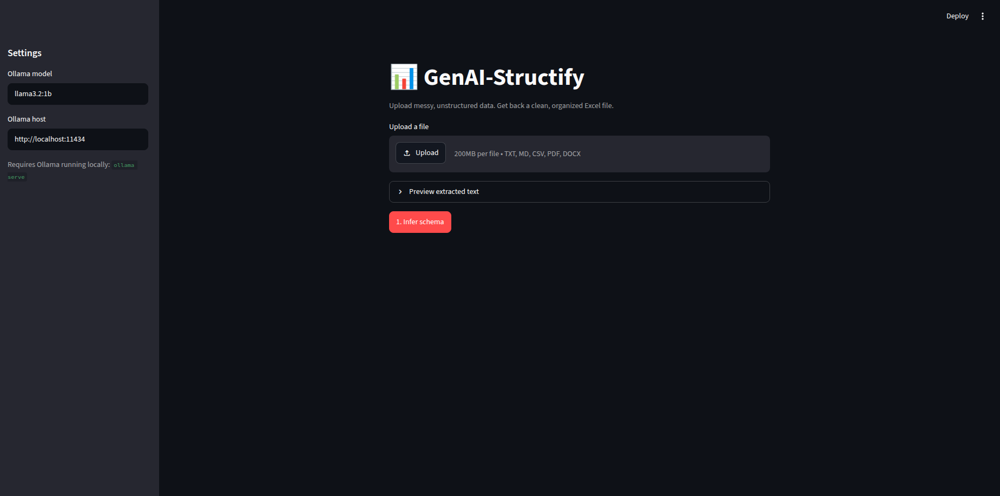
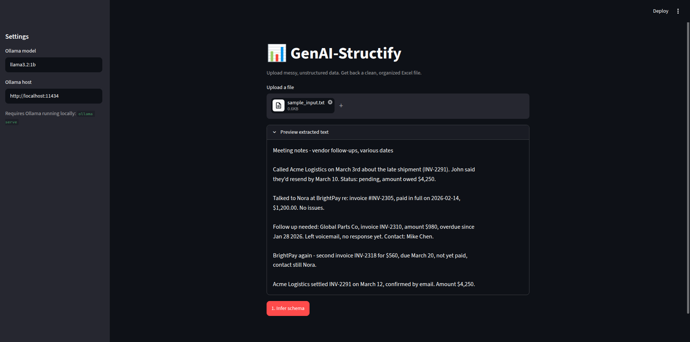
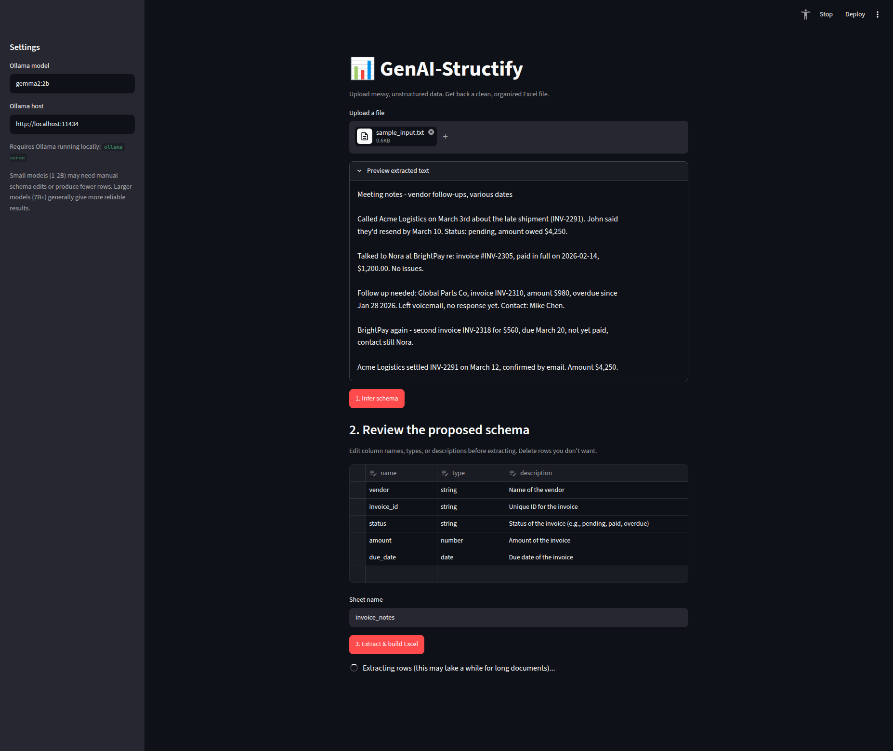

# 📊 GenAI-Structify

**Turn messy, unstructured data into a clean, organized Excel file — powered by a local LLM.**

Paste in free text, or upload a PDF, Word doc, or notes file. GenAI-Structify infers a sensible column structure, lets you review and edit it, then extracts every matching record into a ready-to-use `.xlsx`. No manual schema design, no API key, no data ever leaving your machine.

<p align="left">
  
  
  
  
  <a href="https://github.com/Majd2404/genai-structify/actions"></a>
</p>

---

## Quick start

```bash
# 1. Install Ollama and pull a model (one-time setup)
#    Linux:
curl -fsSL https://ollama.com/install.sh | sh
#    macOS / Windows: download from https://ollama.com
ollama pull gemma2:2b
ollama serve   # if you get "address already in use", it's already running — skip this

# 2. Clone and enter the project
git clone https://github.com/Majd2404/genai-structify.git
cd genai-structify

# 3. Create + activate a virtual environment (avoids "externally-managed-environment" errors)
python3 -m venv venv
source venv/bin/activate        # Windows: venv\Scripts\activate

# 4. Install dependencies
pip install -r requirements.txt

# 5. Run the web UI
streamlit run app.py
```

Then open `http://localhost:8501` in your browser (it usually opens automatically) and upload `examples/sample_input.txt` to see it in action.

## Table of contents

- [Quick start](#quick-start)
- [Why this exists](#why-this-exists)
- [Interfaces](#interfaces)
- [How it works](#how-it-works)
- [Example](#example)
- [Installation](#installation)
- [Usage](#usage)
- [Architecture](#architecture)
- [Testing](#testing)
- [Known limitations / roadmap](#known-limitations--roadmap)
- [Contributing](#contributing)
- [License](#license)

---

## Why this exists

Most "AI + Excel" demos are toy wrappers around a single prompt fired at a hosted API. This project is built to actually hold up on real, messy input, and to run without a paid API key:

- **Schema inference is a separate step from extraction.** The model first proposes what columns make sense for *this* data, so you can review and correct it before spending time on the (slower) full extraction pass.
- **Long documents are chunked with overlap, and duplicate rows across chunk boundaries are removed** — a detail that's easy to skip in a demo and immediately breaks on anything longer than a page.
- **Malformed JSON from the model is handled, not assumed away.** The client retries once with a stricter instruction, and fails loudly with a clear message instead of silently returning garbage.
- **Runs entirely locally via [Ollama](https://ollama.com).** No API key, no per-request cost, no data sent anywhere.
- **The model runtime is isolated in one module** (`llm_client.py`), so swapping to a different local model, or to a hosted API, means editing one file — not rewriting the extraction logic.

## Interfaces

GenAI-Structify ships with **two ways to use it**: a web UI for interactive use, and a CLI for scripting/automation.

### Web UI (Streamlit)

Three-step guided flow — upload, review the proposed schema, extract:

| Step 1 — Upload | Step 2 — Review schema | Step 3 — Download result |
|---|---|---|
|  |  |  |

> **Note for contributors:** the images above are placeholders. Run `streamlit run app.py`, upload `examples/sample_input.txt`, and save screenshots of each step into `docs/screenshots/` using the filenames shown above. A short screen recording (GIF or a Loom link) dropped in this section makes an even stronger first impression than static screenshots.

```bash
streamlit run app.py
```

### Command line (CLI)

Same pipeline, scriptable — good for batch processing or CI integration:

```bash
python -m genai_structify.cli invoices.pdf -o invoices.xlsx
```

## How it works

```
messy notes.txt / report.pdf / dump.docx
              │
              ▼
      1. Schema inference   (LLM proposes columns from a sample)
              │
              ▼
      2. Review & edit       (web UI table, or --schema-file on the CLI)
              │
              ▼
      3. Structured extraction   (LLM pulls rows, chunked for long docs, deduplicated)
              │
              ▼
      4. Excel generation   (styled, auto-sized, ready to open)
              │
              ▼
          output.xlsx
```

## Example

Input (`examples/sample_input.txt`) — free-form meeting notes about vendor invoices:

```
Called Acme Logistics on March 3rd about the late shipment (INV-2291). John said
they'd resend by March 10. Status: pending, amount owed $4,250.

Talked to Nora at BrightPay re: invoice #INV-2305, paid in full on 2026-02-14,
$1,200.00. No issues.
...
```

Run:

```bash
python -m genai_structify.cli examples/sample_input.txt -o invoices.xlsx
```

Output — a clean spreadsheet with an inferred schema like:

| vendor | invoice_id | amount | status | due_date | contact |
|---|---|---|---|---|---|
| Acme Logistics | INV-2291 | 4250 | paid | 2026-03-10 | John |
| BrightPay | INV-2305 | 1200 | paid | 2026-02-14 | Nora |
| Global Parts Co | INV-2310 | 980 | overdue | 2026-01-28 | Mike Chen |

## Installation

1. **Install [Ollama](https://ollama.com)** and pull a model:

   **Linux:**

   ```bash
   curl -fsSL https://ollama.com/install.sh | sh
   ```

   > If `ollama` isn't found after installing, make sure the install script finished without errors and try opening a new terminal. Alternatively, `sudo snap install ollama` works too, though the snap package can lag behind on new model support.

   **macOS / Windows:** download the installer from [ollama.com](https://ollama.com).

   **Then, on any OS:**

   ```bash
   ollama pull gemma2:2b
   ollama serve   # if you get "address already in use", it's already running — skip this
   ```

2. **Clone the project:**

   ```bash
   git clone https://github.com/Majd2404/genai-structify.git
   cd genai-structify
   ```

3. **Create and activate a virtual environment.**

   On modern Debian/Ubuntu systems, `pip install` at the system level is blocked by default (`externally-managed-environment` error) — a virtual environment avoids this entirely and is good practice regardless of OS:

   ```bash
   python3 -m venv venv

   # Activate it:
   source venv/bin/activate       # Linux / macOS
   venv\Scripts\activate          # Windows (Command Prompt / PowerShell)
   ```

   Your terminal prompt should now start with `(venv)`. Every command below assumes the virtual environment is active.

4. **Install dependencies:**

   ```bash
   pip install -r requirements.txt
   ```

5. **(Optional) Set up environment variables:**

   ```bash
   cp .env.example .env   # only needed if Ollama runs on a non-default host/port
   ```

> **Troubleshooting:** If `pip install` still fails with `externally-managed-environment` even after creating a venv, double check step 3 actually activated it — run `which python` (Linux/macOS) or `where python` (Windows) and confirm it points inside your `venv` folder, not `/usr/bin/python`.

## Usage

### Web UI

```bash
streamlit run app.py
```

Opens a browser at `http://localhost:8501`:

1. **Upload** a file (`.txt`, `.md`, `.csv`, `.pdf`, `.docx`)
2. **Review and edit the proposed schema** in an editable table — rename columns, change types, add/remove fields — before running the (slower) full extraction
3. **Extract and download** the resulting `.xlsx`, with a live preview table in the browser

### CLI

**Full pipeline** — infer schema, extract, write Excel:

```bash
python -m genai_structify.cli path/to/input.pdf -o output.xlsx
```

**Preview the schema only**, before committing to full extraction:

```bash
python -m genai_structify.cli path/to/input.txt --schema-only
```

**Reuse a schema** across multiple files (e.g. a recurring report format), skipping inference:

```bash
python -m genai_structify.cli path/to/input.txt --schema-file my_schema.json -o output.xlsx
```

A schema file looks like:

```json
{
  "sheet_name": "invoices",
  "fields": [
    {"name": "vendor", "type": "string", "description": "Company name"},
    {"name": "amount", "type": "number", "description": "Invoice amount in USD"}
  ]
}
```

**Use a different local model:**

```bash
python -m genai_structify.cli path/to/input.txt --model mistral
```

### Supported input types

`.txt`, `.md`, `.csv`, `.pdf` (text-based), `.docx`

## Architecture

```
genai_structify/
├── llm_client.py      # Ollama-isolated LLM wrapper: prompt in, parsed JSON out, with retry
├── readers.py          # File-type-specific text extraction (txt/pdf/docx)
├── extractor.py        # Schema inference + chunked, deduplicated row extraction
├── excel_writer.py      # Styled .xlsx generation via openpyxl
└── cli.py               # Command-line entry point

app.py                   # Streamlit web UI (upload -> review schema -> extract -> download)
```

**Design decisions worth noting:**

- `llm_client.py` never leaks into `extractor.py`'s logic — the extraction/schema-inference code only calls `client.extract_json(...)`, so the underlying model runtime is an implementation detail.
- Schema inference and row extraction are two separate LLM calls on purpose, not one combined prompt — it keeps the "propose, then commit" UX possible in both the CLI (`--schema-only`) and the web UI (the editable table).
- Chunking uses a fixed overlap window with deduplication on the resulting rows, rather than trying to be clever about splitting on paragraph/sentence boundaries — simpler, and works uniformly across input types.

## Testing

```bash
source venv/bin/activate   # if not already active
pip install -r requirements-dev.txt
pytest -v
ruff check .
```

Tests cover chunking/overlap behavior, cross-chunk deduplication, and Excel output — all without requiring Ollama to be running (a fake LLM client stands in for network-dependent tests). CI runs this on every push via GitHub Actions (see badge above).

## Known limitations / roadmap

- **Scanned/image PDFs aren't supported yet** — only text-layer PDFs. OCR (via Tesseract) is the next planned input type.
- **Very small local models (1-2B params) often fail at schema *design*, not just extraction.** In testing with `llama3.2:1b`, schema inference sometimes proposed one field per topic/entity mentioned in the document (e.g. `acme_logistics`, `nora_updates`) instead of shared row-level columns (`vendor`, `amount`, `status`) — which makes extraction impossible and silently returns 0 rows. The schema-inference prompt has been tightened with an explicit right/wrong example to reduce this, and extraction failures are now surfaced as warnings instead of failing silently — but manually reviewing (or rewriting) the proposed schema before extracting is still recommended with small models. Models in the 7B+ range are noticeably more reliable at both steps.
- **Even with a correct schema, 1B models can under-extract.** In one test, `llama3.2:1b` was given a clean, correct schema and a 5-record document, but collapsed everything into a single unwrapped record instead of an array of five. The automatic recovery logic (see `_normalize_to_row_list` in `extractor.py`) rescued that one record instead of discarding it, but it can't invent the other four — it can only recover what the model actually returned. `gemma2:2b` is the current default specifically because it's noticeably better at enumerating multiple records per chunk while still running comfortably on machines with limited RAM (~2GB). Models below ~2B parameters should be considered a "may need retries or a bigger model" tier, not a reliable default.
- **Local models are noticeably less reliable at strict JSON output** than hosted frontier models — the retry-once logic in `llm_client.py` exists specifically to compensate for this. Larger local models (e.g. `llama3.1:70b`) or a hosted API can be swapped in via a small edit to `llm_client.py` if extraction quality matters more than running cost-free.
- Extraction quality depends on how clearly the source data expresses repeated structure — free-flowing prose extracts less reliably than semi-structured notes/logs.
- No per-chunk progress bar yet in the Streamlit UI for very large documents (just a spinner).

## Contributing

Issues and pull requests are welcome. Please run `pytest` and `ruff check .` before submitting — both are enforced in CI.

## License

MIT — see [LICENSE](LICENSE).
